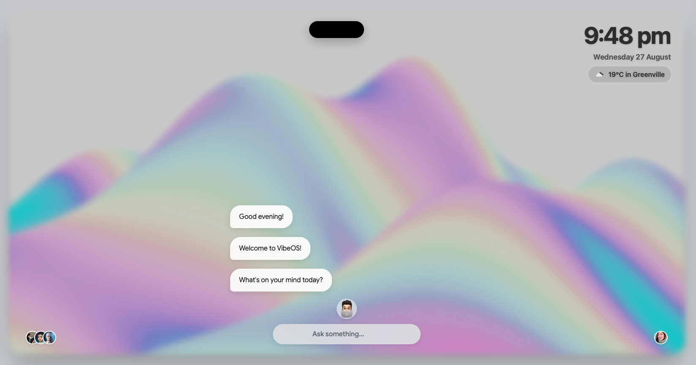

<p align="center">
  
  <h2 align="center">VibeOS - A Conversational AI Desktop</h2>
  <p align="center">An experimental, AI-powered operating system built entirely in the browser, featuring a conversational interface, window management, and integrated AI tools.</p>
</p>

<p align="center">
  
  
  
  
  
</p>

<p align="center">
  <a href="#">View Live Demo</a> ·
  <a href="#">Report Bug</a> ·
  <a href="#">Request Feature</a>
</p>

---

## ✨ Overview

VibeOS is a fully-featured, simulated desktop environment that runs entirely in a web browser. It's built from the ground up with **vanilla JavaScript, HTML5, and CSS3**, showcasing a modern "glassmorphism" aesthetic and a powerful conversational AI at its core.

The project moves beyond a simple webpage to offer a persistent, interactive, and productive user experience, powered by the **Google Gemini API**. Users can launch apps in movable windows, get assistance from AI, and customize their environment, all through a clean and intuitive interface.

*   **Conversational Command Center:** Use the central prompt bar or voice commands to talk to the AI, launch apps, manage tasks, control music, and get information.
*   **Dynamic Window Tiling:** A sophisticated window manager that automatically arranges open applications in a "center stage" layout for seamless multitasking.
*   **"Live Activities" Island:** A Dynamic Island-inspired UI element that provides real-time updates and controls for background tasks like music playback and focus timers.
*   **Integrated AI Tools:**
    *   **AI Trip Planner:** Generate detailed, day-by-day travel itineraries by describing your desired trip.
    *   **VibeOS Scholar:** An AI-powered homework helper that analyzes uploaded images of questions and provides step-by-step solutions using a multimodal vision model.
*   **Persistent Customization:** Your theme (light/dark mode), wallpaper, docked apps, and scratchpad notes are all saved locally, creating a personalized experience across sessions.
*   **Voice Command Integration:** Built with the Web Speech API, allowing for hands-free interaction with the AI assistant.

---

## 🚀 Getting Started

To get a local copy up and running, follow these simple steps.

### Prerequisites

*   A modern web browser (e.g., Chrome, Firefox, Edge).
*   A local web server to avoid CORS issues with API calls. The [Live Server](https://marketplace.visualstudio.com/items?itemName=ritwickdey.LiveServer) extension for VS Code is a great option.

### Installation

1.  **Clone the repo**
    ```bash
    git clone https://github.com/dave21-py/ai-desktop-os.git
    ```
2.  **Navigate to the project directory**
    ```bash
    cd ai-desktop-os
    ```
3.  **Set up API Keys**
    The project requires API keys for Google Gemini and OpenWeather.
    *   Create a new file named `config.js` inside the `js/` directory.
    *   Add your API keys to this file in the following format:
        ```javascript
        // js/config.js
        const GEMINI_API_KEY = "YOUR_GOOGLE_GEMINI_API_KEY";
        const OPENWEATHER_API_KEY = "YOUR_OPENWEATHERMAP_API_KEY";
        ```
4.  **Run the project**
    *   If using VS Code with Live Server, right-click on `index.html` and select "Open with Live Server".
    *   Otherwise, start your local server and navigate to the `index.html` file.

---

## 🛠️ Tech Stack

*   **Frontend:** Vanilla JavaScript (ES6+), HTML5, CSS3
*   **AI & APIs:**
    *   [Google Gemini API](https://ai.google.dev/) (for text and vision models)
    *   [OpenWeather API](https://openweathermap.org/api) (for the weather widget)
    *   [Web Speech API](https://developer.mozilla.org/en-US/docs/Web/API/Web_Speech_API) (for voice commands)

---

## 📂 Folder Structure

The project is organized in a straightforward manner:

-   `/`
    -   `index.html`: The main entry point and HTML structure for the OS.
    -   `css/`
        -   `main.css`: Contains all styles for the OS, components, and animations.
    -   `js/`
        -   `main.js`: Handles DOM manipulation, event listeners, and UI state.
        -   `os-core.js`: The main `WarmwindOS` class that contains the core logic, AI communication, and command handling.
        -   `config.js`: **(You must create this)** Stores the necessary API keys.
    -   `assets/`: Contains all static files like wallpapers, icons, sounds, and music tracks.

---

## 🌐 Deployment

This project is a static web application and can be easily deployed on platforms like **Vercel**, **Netlify**, or **GitHub Pages**.

When deploying, ensure you use environment variables to store your `GEMINI_API_KEY` and `OPENWEATHER_API_KEY` securely instead of committing them in the `config.js` file. You may need to slightly adapt the code to read these variables from the deployment environment.

---

## 🙌 Contributing

Contributions, issues, and feature requests are welcome! Feel free to check the issues page.
